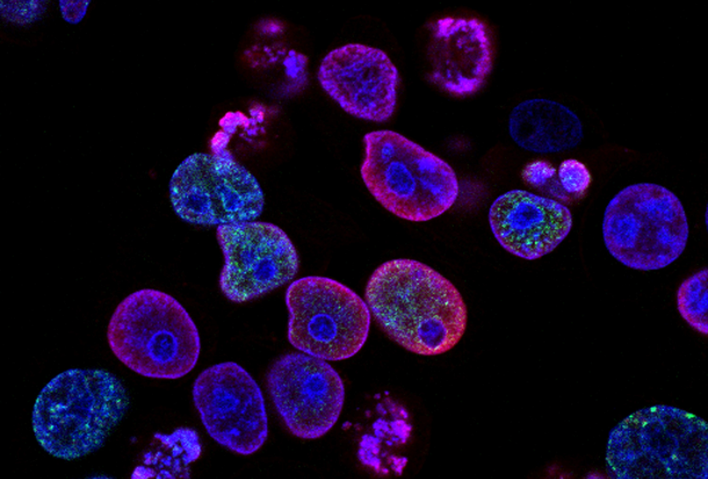

# Cellino software development
> A guide to configuring your local environment.

## Prerequisites
The main prerequisites for our development environment are `git` and `pyenv`. These tools help manage code repositories and local Python environments, respectively. Each developer also needs to configure `gcloud` as a way to authenticate access to our cloud services. Package managers, such as [homebrew](https://brew.sh/) or [chocolatey](https://chocolatey.org/), are highly recommended to streamline installation procedures.
## Quickstart Guides
* [Windows](docs/environment/windows)
* [Mac](docs/environment/mac)
* [Linux](docs/environment/linux)
* [Git](docs/tools/git)
* [Pyenv](docs/tools/pyenv)

<footer>Copyright © 2021 Cellino Biotech</footer>